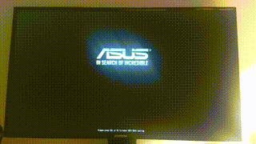

# alux - a minimal Linux kernel distribution

This repo holds, for educational purposes, step-by-step procedures for creating a minimal distribution of the Linux kernel.

The immediate goal is to build from scratch a bootable USB-stick which can boot up a (custom made) graphical shell with mouse and keyboard support and eventually support basic Wayland apps. We are not going to use any existing user space apps such as Xorg, bash or systemd. This is a bare minimum Linux kernel distribution with graphics and devices working.



By only relying on the very Linux kernel and nothing else, one can focus ones attention to this piece of software without the fluffy stuff around.

## The basics of booting
On a modern 64-bit UEFI machine, the boot process can be very minimal and lean. All you really need is a binary named EFI/BOOT/BOOTX64.EFI on a FAT32 filesystem under GPT and with ESP flag set.

So what is the BOOTX64.EFI file? It is the Linux kernel that we will compile from source. It will boot directly by the UEFI motherboard without any bootloader support. Once the kernel has booted up it will start the init process, our graphical shell. That's a working software stack and operating system in only two parts; /boot (the kernel) and /root (the init process and dependencies).


## Partitioning the USB stick

* Put a Fat32 parition of roughly 100mb in the top, mark it as ESP (EFI System Parition) - call it boot
* Add an ext4 parition for remaining space, call it root
* Run bootctl install --path /dev/sdXY on the mounted EFI partition to install systemd-boot (a bootloader, not systemd)

```
[   boot(FAT32)   |                  root(EXT4)                  ]
```

* Take note of the PARTGUID of root partition as we will need to instruct the kernel to mount this as root.

* Boot parition will hold the linux kernel image and its parameters,
* Root partition will hold everything user-space and its needed images, ELF binaries, etc.

## Download, configure and build a vanilla Linux kernel


## Build the shell and populate the root partition

* shell is a dynamically linked ELF binary depending on a few shared objects (.so). Depending on what system you build on it may look different. Use LDD to track dependencies of shell ELF and ship them in /lib64, /usr/lib64 depending on need.
* wallpaper.png lies in root /wallpaper.png
